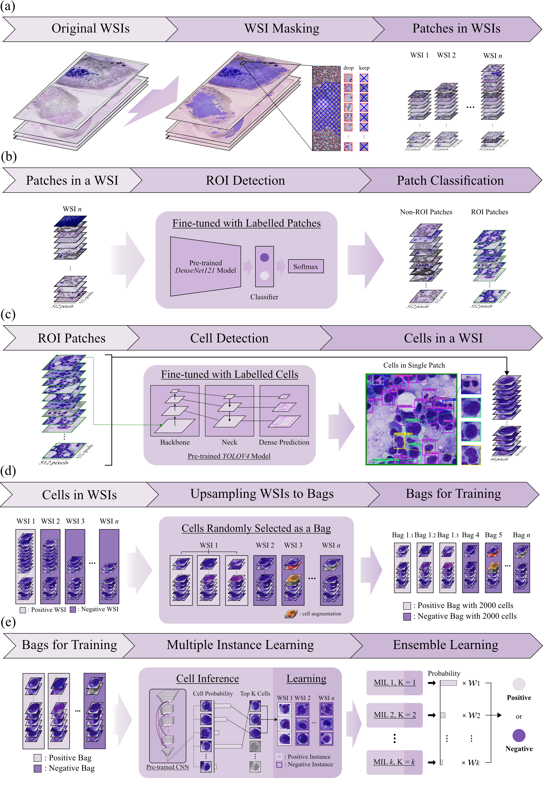

# MIL_gene_prediction_WSI_AML
multiple instance learning for predicting gene mutations from whole slide images of acute myeloid leukemia

 

 Overview of the proposed method.

 ## Using PyHIST for patches generation

 The model architecture and code is based on [PyHIST](https://github.com/manuel-munoz-aguirre/PyHIST).

For every WSI:
    
    python pyhist.py --content-threshold 0.05 --output /path/to/your/output/directory --output-downsample 1 --save-patches --save-tilecrossed-image --info "verbose" /path/to/your/WSI
For a WSI directory set:

    python /code/run_pyHIST.py
